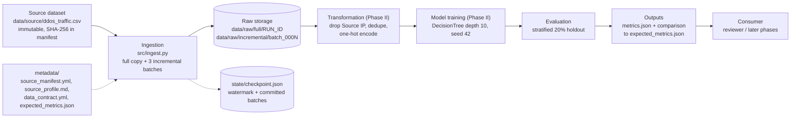

# Lifecycle: DDoS Traffic classification

```mermaid
flowchart LR
  A["Source dataset<br/>data/source/ddos_traffic.csv<br/>immutable, SHA-256 in manifest"] --> B["Ingestion<br/>src/ingest.py<br/>full copy + 3 incremental batches"]
  B --> C[("Raw storage<br/>data/raw/full/RUN_ID<br/>data/raw/incremental/batch_000N")]
  B -.-> S[("state/checkpoint.json<br/>watermark + committed batches")]
  C --> D["Transformation (Phase II)<br/>drop Source IP, dedupe,<br/>one-hot encode"]
  D --> E["Model training (Phase II)<br/>DecisionTree depth 10, seed 42"]
  E --> F["Evaluation<br/>stratified 20% holdout"]
  F --> G["Outputs<br/>metrics.json + comparison<br/>to expected_metrics.json"]
  G --> H["Consumer<br/>reviewer / later phases"]
  M["metadata/<br/>source_manifest.yml, source_profile.md,<br/>data_contract.yml, expected_metrics.json"] -.-> B
```